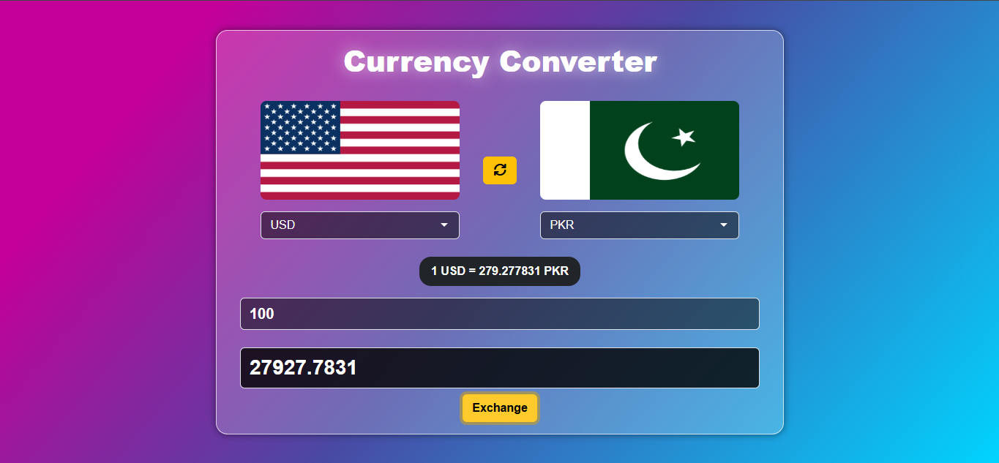

# Currency Converter

A modern, responsive **Currency Converter** web application built with HTML, CSS, and JavaScript. It provides real-time exchange rates and supports conversion between 100+ currencies with beautiful flag visuals.

---

## Live Demo
> Live Link: [Currency Converter Preview](https://hameed-codes.github.io/Currency-Converter/)

---

## Screenshot

---

## Features

- Real-time currency conversion using a reliable exchange rate API
- Instant flag updates based on selected currency
- Swap currencies with a single click
- Clean, modern UI with gradient background and glassmorphism effect
- Fully responsive design
- Input validation with error feedback
- Supports 100+ world currencies

---

## Technologies Used

- **HTML5**
- **CSS3** (with Bootstrap 5 & custom styling)
- **Vanilla JavaScript**
- [Exchange Rate API](https://open.er-api.com)
- Flag icons from [flagcdn.com](https://flagcdn.com)

---

## Author
Made with ❤️ by [Hameed Khan](https://github.com/hameed-codes)
